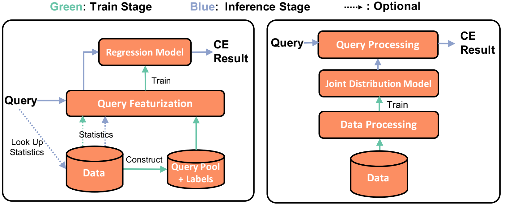
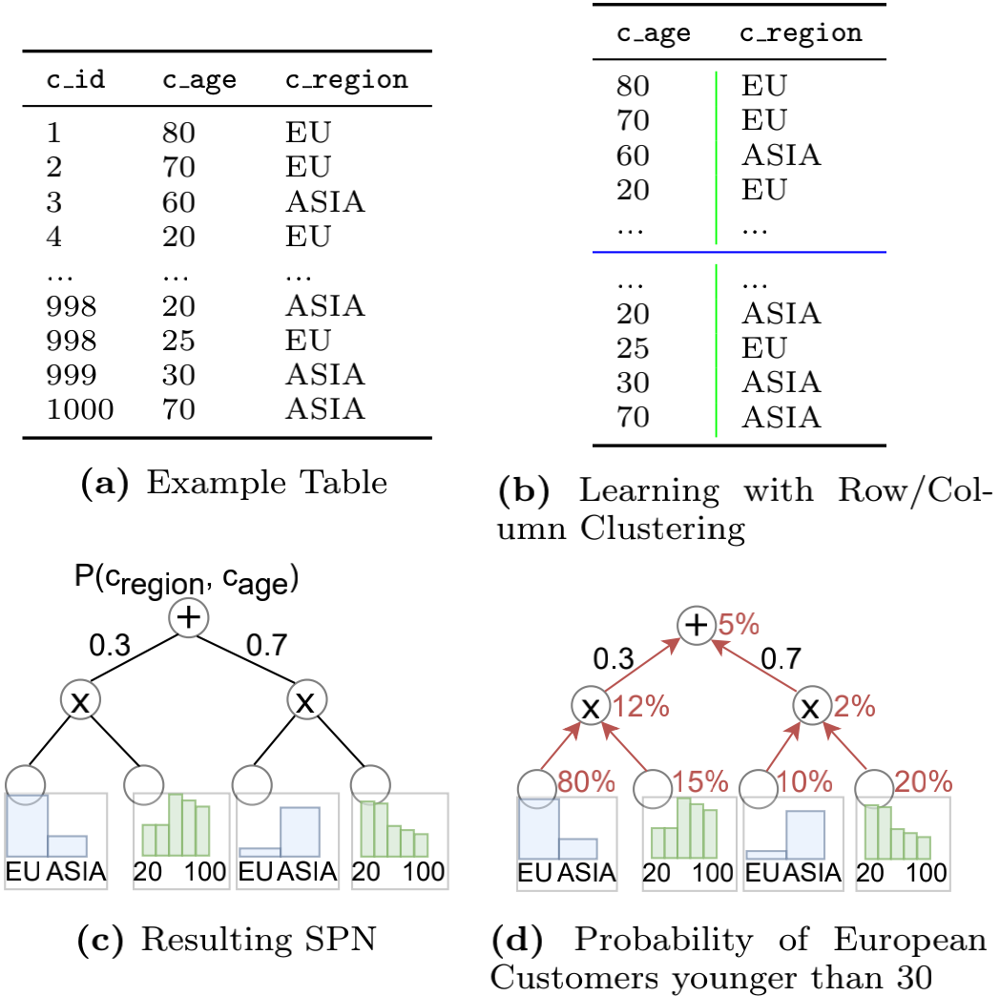
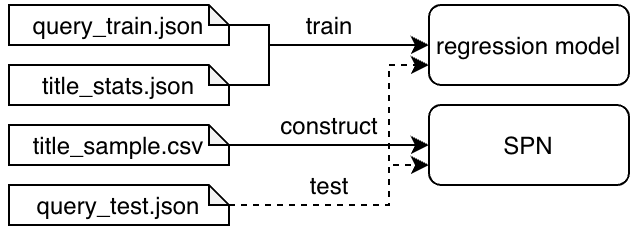

# LAB1 Learning-based Cardinality Estimation

## Introduction
Query optimizers depend on cardinality estimates of query predicates to produce a good execution plan. When a query contains multiple predicates, today’s optimizers use a variety of assumptions, such as independence between predicates, to estimate cardinality. These methods often incur large cardinality estimation errors. Recently, some novel learning-based models are proposed to estimate cardinality, such as deep neural networks, gradient boosted trees, sum-product networks.

Based on the methodology, we split them into two groups:

+ query-driven methods: they model cardinality estimation as a regression problem and aim to build a mapping between queries and the estimation results via feature vectors.
+ data-driven methods: they model cardinality estimation as a joint probability distribution estimation problem and aim to construct the joint distribution from the table data.

## A query-driven method

## A data-driven method
We use sum-product networks(SPN) here to learn the joint probability distribution of our data. It can capture correlation between multiple columns.

Intuitively, sum nodes split rows and product nodes split columns. Leaf nodes represent a single column and in our lab we use histograms for it. For instance, in the picture below, an SPN was learned over the column `region` and `age` of the customer table.

+  The top sum node splits the data into two groups, and the left group contains 30% rows, which is dominated by older European customers, and the right group contains 70% rows with younger Asian customers.
+  Then next in both groups, `region` and `age` are split by a product node each. 
+  The leaf nodes determine the probability distributions of the column `region` and `age` for every group.

Learning SPNs works by recursively splitting the data in different groups of rows (introducing a sum node) or groups of independent columns (introducing a product node). 
+ for the splitting of rows, a standard algorithm such as KMeans can be used. 
+ for the splitting of columns, some measures of correlation such as Pearson correlation coefficient can be used.

With an SPN at hand, we can compute probabilities for predicates on arbitrary columns. Intuitively, the conditions are first evaluated on every relevant leaf. Afterwards, the SPN is evaluated bottom up. 

For instance in the picture above, to estimate `where region='Europe' and age<30`,  we compute the probability of European customers in the corresponding blue region leaf nodes (80% and 10%) and the probability of a customer being younger than 30 (15% and 20%) in the green age leaf nodes. These probabilities are then multiplied at the product node level above, resulting in probabilities of 12% and 2%, respectively. Finally, at the root level (sum node), we have to consider the weights of the clusters, which leads to 12% · 0.3 + 2% · 0.7 = 5%. Multiplied by the number of rows in the table, we get an approximation of 50 European customers who are younger than 30.

## LAB1

In lab1, you should implement two estimation methods, a query-driven method based on regression models like neural networks and a data-driven method based on SPNs.

### The Input

In this lab, we use `IMDB.title` to train and test our models. All data is in `data` directory and it consists of:

+ `title_schema.sql`: the schema of the table `title`;
+ `query_train_*.json`: queries used to train your model;
+ `query_test_*.json`: queries used to test your model;
+ `title_sample_*.csv`: sample data used to construct your SPN;
+ `title_stats.json`: statistics of `title` exported from TiDB;

For simplicity, all queries we used in lab1 are well formatted range queries with the same pattern `select * from imdb.title where c1>? and c1<? and c2>? and c2<? and ...`.

And all columns that appear in our queries are int column, more specifically, you can only consider `kind_id`, `production_year`, `imdb_id`, `episode_of_id`, `season_nr`, `episode_nr` columns in lab1.

These files are expected to be used as below:

### The Code

In `range_query.py`, we've implemented some functions that can help you parse range queries well.

In `statistics.py`, we've implemented some structure related to statistics. `TableStats` is the abstraction of a table's statistics, which consists of multiple columns. A column's statistics is stored in a `Histogram` and a `TopN`, and they can do estimation for single-column predicates well. For multi-column predicates estimation, some estimators based on different strategies(AVI, ExpBackOff and MinSel) can be used.

You need to fill some missing code in `learn_from_query.py`, `learn_from_data.py` and `statistics.py`. Missing code is marked with comment `YOUR CODE HERE`.

After you fill all missing code, you can run `python evaluation.py` and it will test your models and generate a report under `eval` directory.

